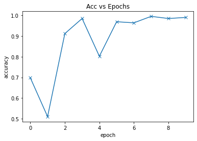

# ML4SC_GSoc22
### GSOC22 evaluation results
# **Exploring** **transformers**
## Datset Used:
#### I used the dataset provided by deepmind on their test document.It contains two types of images one with substructure and one with no substructure.I #### divided the data into two categories Test and Train by 10:90.Here is the imageof data.

## Model:
#### I created my own deep RESNET model with 10+ layers of CNN’s and 2 Layers of Resnets.

## Evaluation:
#### I trained the data with the batch size of 32 for 20 to 330 epochs and results were awesome.I achieved an accuracy of 99.48% after 20 epochs.
#### Here you can see the training process of model.

### Evaluate you own validation set by IPYNB notebook.

